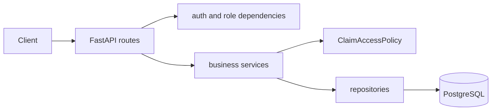

# 20-minute technical walkthrough

## Minutes 0–2: introduction

“This is a deliberately small but security-focused expense-claim API. FastAPI handles HTTP
and validation, services own business rules, repositories own persistence, and one claim policy
owns resource authorization. Authentication uses Argon2 and short-lived HS256 JWTs, while the
database user—not token role data—is always the authority. PostgreSQL startup, idempotent seed
data, a non-root container, and negative authorization tests make it runnable and reviewable.”

## Minutes 2–4: architecture and request flow

`app/main.py:create_app` assembles routers and safe error handling. A request obtains one
session from `app/db/database.py:get_db`; dependencies authenticate, routes validate schemas,
services enforce rules, and repositories issue parameterized SQLAlchemy statements.

Startup runs `initialize_database`: bounded `SELECT 1` retries, metadata creation, independent
user creation, manager linking, and deterministic per-employee seed-claim checks. A transaction
is rolled back on failure. Restarting does not duplicate rows.

## Minutes 4–8: authentication

Registration flows through `api/auth.py:register` to
`services/authentication.py:register`; its extra-forbid schema accepts only normalized email and
password, hashes with Argon2, and always creates EMPLOYEE. Login checks the IP limiter, looks up
the normalized email, performs either real or dummy Argon2 verification, and returns the same
401 message for an unknown email and bad password.

`core/security.py:create_access_token` encodes only string `sub` and UTC `exp` using HS256.
`decode_access_token` requires both claims, verifies expiration/signature, pins the algorithm,
and validates a positive numeric subject. `api/dependencies.py:get_current_user` then reloads the
user: deleted users immediately lose access and role changes apply immediately. Missing,
malformed, tampered, expired, or invalid-sub tokens all yield a clean 401 plus
`WWW-Authenticate: Bearer`.

Argon2 is memory-hard and deliberately expensive, raising offline password-cracking cost.
Passwords/hashes never enter response schemas, JWTs, logs, or exceptions.

## Minutes 8–13: authorization

`api/dependencies.py:require_roles` handles endpoint-level roles. Resource ownership lives in
`services/claim_access.py:ClaimAccessPolicy`. `build_visibility_statement` generates SQL rather
than filtering Python objects. Employees match `Claim.user_id == current_user.id`; managers join
claim owners and match their own ID or `User.manager_id == current_user.id`; admins are
unrestricted. `ensure_can_change_status` prevents manager self-approval and permits only direct
reports. The service first loads by claim ID: missing is 404, existing but forbidden is 403.

| Code | Meaning |
|---|---|
| 401 | caller is not validly authenticated |
| 403 | authenticated but forbidden |
| 404 | record truly does not exist |
| 409 | duplicate/current state conflicts |
| 429 | failed-login window exceeded |

## Minutes 13–15: state and concurrency

`services/claims.py:change_status` authorizes before mutation and rejects non-pending state with
409. `repositories/claims.py:transition_pending` executes a conditional update by ID and
PENDING status. Exactly one concurrent request can update a row; a loser receives 409 after a
zero-row result. Input validation accepts only APPROVED or REJECTED.

## Minutes 15–17: persistence and deployment

`User.manager_id` is a self-foreign key with `ON DELETE SET NULL`; claims use `ON DELETE
CASCADE`. ORM relationships mirror those decisions. `Numeric(12,2)` and Decimal avoid binary
float errors. Sessions are request-scoped and always closed.

The Dockerfile copies pinned uv 0.11.16, installs locked production dependencies before source
for caching, uses `python:3.11-slim`, and runs as `api`, not root. Compose waits for PostgreSQL's
`pg_isready`, persists a named volume, and supplies local-only defaults. One worker is intentional
because the limiter is process-local; production would use Redis and multiple workers/instances.

## Minutes 17–19: tests

Tests override `get_db` with an isolated in-memory SQLite engine, enable foreign keys, reset the
limiter, and exercise real JWT/dependency/policy paths. Key negatives: an employee receives 403
for another employee's existing claim; managers cannot see or approve emp3; managers cannot
approve themselves; completed claims cannot transition; deleted-user tokens fail.

## Minutes 19–20: assumptions and improvements

Metadata creation is assignment-friendly; production needs Alembic. Compose credentials are
local only. The limiter and direct-IP handling are documented single-instance choices. Add Redis,
audit trails, secret management, proxy trust, key rotation, observability, and backups in production.

## Swagger live demo

1. Login as emp1, authorize, call `/me`, list/create/retrieve a claim, then retrieve emp2's claim (403).
2. Login as manager; show emp1/emp2 but not emp3, approve emp1, try emp3 (403), retry emp1 (409).
3. Login as admin; show all claims, register a disposable user, and delete that user (204).

## Five files to study

1. `app/api/dependencies.py` — authentication and endpoint-role dependency.
2. `app/services/claim_access.py` — visibility, ownership, direct-report policy.
3. `app/services/claims.py` — claim rules and 403/404/409 sequencing.
4. `app/core/security.py` — Argon2 and JWT primitives.
5. `app/db/initialization.py` — retry and idempotent seeding.

## Interview questions

1. **Why reload the user?** Database role/deletion changes take effect immediately.
2. **Why no role in JWT?** It would become stale authorization data.
3. **Why `sub` is a string?** JWT defines subject as a string claim.
4. **Why pin HS256?** It prevents algorithm-confusion acceptance.
5. **Why require `exp`?** Missing expiry must not create perpetual access.
6. **Why Argon2?** Its memory cost resists parallel cracking better than fast hashes.
7. **Why dummy verification?** It reduces obvious timing differences for unknown accounts.
8. **Why a generic login error?** It avoids account enumeration.
9. **Why 403 for an existing foreign claim?** Authentication is valid and the resource exists,
   but policy denies access; this is the assignment's explicit semantic contract.
10. **Why load by ID first?** Combining ID and ownership would incorrectly turn 403 into 404.
11. **Where is ownership checked?** `ClaimAccessPolicy.can_view_claim` and
    `ensure_can_view_claim`.
12. **Where are roles checked?** `api/dependencies.py:require_roles`.
13. **How does manager visibility work?** An SQL join checks owner.manager_id, plus own claims.
14. **Can a manager self-approve?** No; update policy requires a different owner.
15. **Why condition the update on PENDING?** It makes conflicting concurrent transitions atomic.
16. **Why Decimal?** Exact base-10 monetary representation.
17. **Why Numeric(12,2)?** It enforces a bounded exact database representation.
18. **What closes sessions?** The `finally` in the yielding `get_db` dependency.
19. **Why `pool_pre_ping`?** It detects stale pooled PostgreSQL connections.
20. **How is seeding idempotent?** Every email and deterministic claim title is checked independently.
21. **Why one worker?** In-memory rate-limit state is not shared across processes.
22. **Why `Retry-After`?** It tells clients when a throttled request may be retried.
23. **Why ignore X-Forwarded-For?** Arbitrary clients can spoof it without trusted-proxy setup.
24. **Why non-root Docker?** A compromise has fewer container privileges.
25. **Why SQLite tests?** Fast isolation; PostgreSQL integration tests remain a production addition.
26. **Why block admin self-delete?** It prevents accidental administrative lockout.
27. **What happens when a manager is deleted?** Reports become unassigned via SET NULL.
28. **What happens when a user is deleted?** Their claims cascade-delete.
29. **Why services and repositories?** Rules and query mechanics remain independently readable.
30. **What would you add first?** Alembic, Redis, secrets management, audit logs, and PostgreSQL CI.

### Difficult follow-ups

- **Does in-memory limiting work across replicas?** No; Redis with atomic sliding-window logic is needed.
- **Does SQLite prove PostgreSQL concurrency?** No; the conditional SQL design is portable, but add a real
  PostgreSQL race test for deployment confidence.
- **Could HS256 keys rotate seamlessly?** Not with the minimal token; production can add `kid` and a key ring.
- **Can metadata creation evolve schemas?** No; it creates missing tables but does not migrate existing ones.
- **Can a proxy change the observed IP?** Yes; explicitly configure trusted proxy hops before honoring headers.

The design keeps the security-critical path short: authenticate from the database, authorize in
one policy, mutate atomically, and verify negative behavior at the HTTP boundary.
